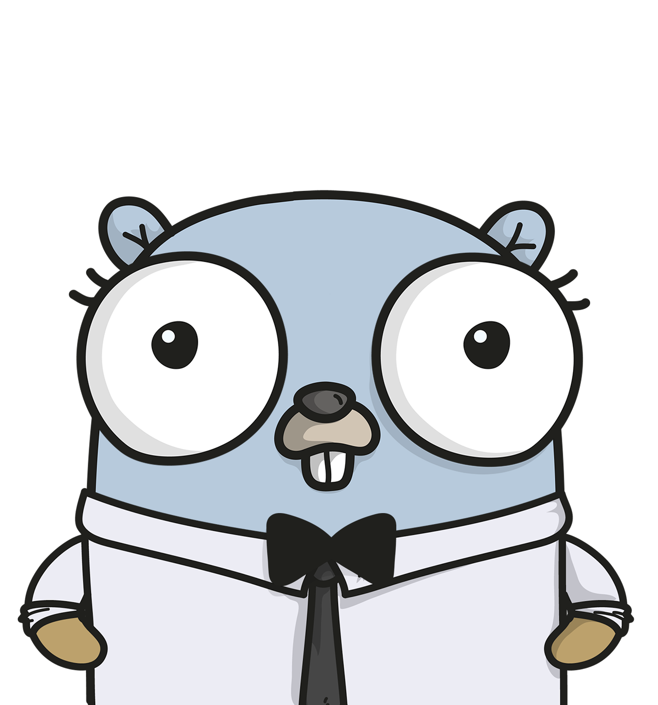

# miro-gopher

API client for accessing the MIRO API

Currently, only supports the `/boards` endpoint, but more to follow soon.

For now the `GET`, `POST`, `PUT`, `PATCH` & `DELETE` methods are open to use for any other API calls to MIRO.

Minimum required Go version : `1.18`


[](http://godoc.org/github.com/russ-davey/miro-gopher)
[](https://github.com/russ-davey/miro-gopher/actions/workflows/miro-gopher.yml)

[](https://github.com/russ-davey/miro-gopher/tags)
[](https://go.dev/doc/go1.2)
[](https://opensource.org/licenses/MIT)



## Installation

```
go get github.com/russ-davey/miro-gopher/miro
```

## Basic Usage

All interaction starts with a `miro.Client`. Create one with your MIRO token:

```Go
import "github.com/russ-davey/miro-gopher/miro"

client := miro.NewClient(token)
```
---
## /boards API Methods

### Get

```go
client.Boards.Get("3141592")
```

### GetALL

```go
client.Boards.GetAll()
```

or with query parameters:

```go
client.Boards.GetAll(miro.BoardSearchParams{
    TeamID: "gophers",
    Sort: miro.SortAlphabetically,
})
```

### Create

```go
client.Boards.Create(miro.CreateBoard{
    Description: "My Board",
    Name:        "MIRO Gopher",
    Policy: miro.Policy{
        SharingPolicy: miro.SharingPolicy{
            Access:                            miro.AccessPrivate,
            InviteToAccountAndBoardLinkAccess: miro.InviteAccessEditor,
            TeamAccess:                        miro.AccessEdit,
        },
        PermissionsPolicy: miro.PermissionsPolicy{
            SharingAccess:                 miro.AccessBoardOwnersAndCoOwners,
            CopyAccess:                    miro.CopyAccessTeamEditors,
            CollaborationToolsStartAccess: miro.AccessBoardOwnersAndCoOwners,
        },
    },
    TeamID: "gophers",
})
```

### Copy

```go
client.Boards.Copy(miro.CreateBoard{
    Description: "My Board",
    Name:        "MIRO Gopher",
    Policy: miro.Policy{
        SharingPolicy: miro.SharingPolicy{
            Access:                            miro.AccessPrivate,
            InviteToAccountAndBoardLinkAccess: miro.InviteAccessEditor,
            TeamAccess:                        miro.AccessEdit,
        },
        PermissionsPolicy: miro.PermissionsPolicy{
            SharingAccess:                 miro.AccessBoardOwnersAndCoOwners,
            CopyAccess:                    miro.CopyAccessTeamEditors,
            CollaborationToolsStartAccess: miro.AccessBoardOwnersAndCoOwners,
        },
    },
    TeamID: "gophers",
},
    "3141592")
```

### Update
```go
client.Boards.Update(miro.CreateBoard{
    Description: "My New Board",
    Name:        "New MIRO Gopher",
    Policy: miro.Policy{
        SharingPolicy: miro.SharingPolicy{
            Access:                            miro.AccessPrivate,
            InviteToAccountAndBoardLinkAccess: miro.InviteAccessEditor,
            TeamAccess:                        miro.AccessEdit,
        },
        PermissionsPolicy: miro.PermissionsPolicy{
            SharingAccess:                 miro.AccessBoardOwnersAndCoOwners,
            CopyAccess:                    miro.CopyAccessTeamEditors,
            CollaborationToolsStartAccess: miro.AccessBoardOwnersAndCoOwners,
        },
    },
    TeamID: "gophers",
},
"3141592")
```

### Delete

```go
client.Boards.Delete("3141592")
```
---